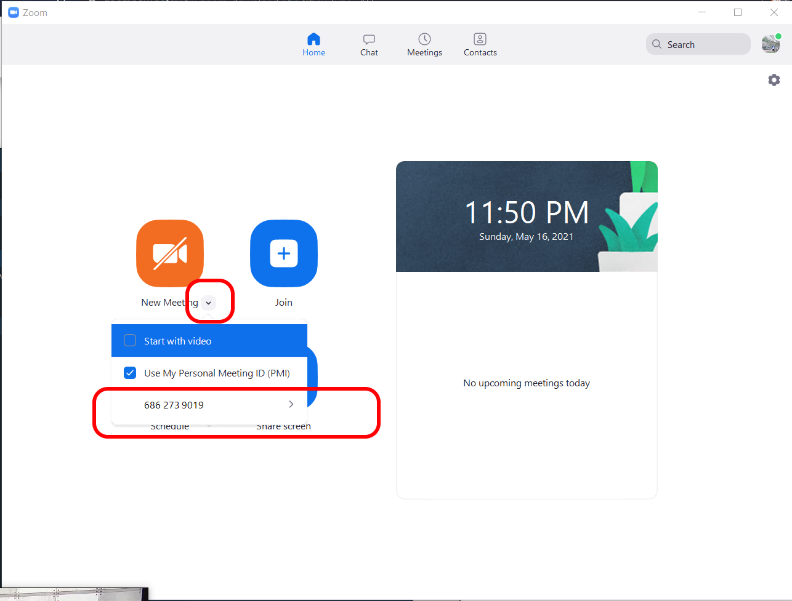
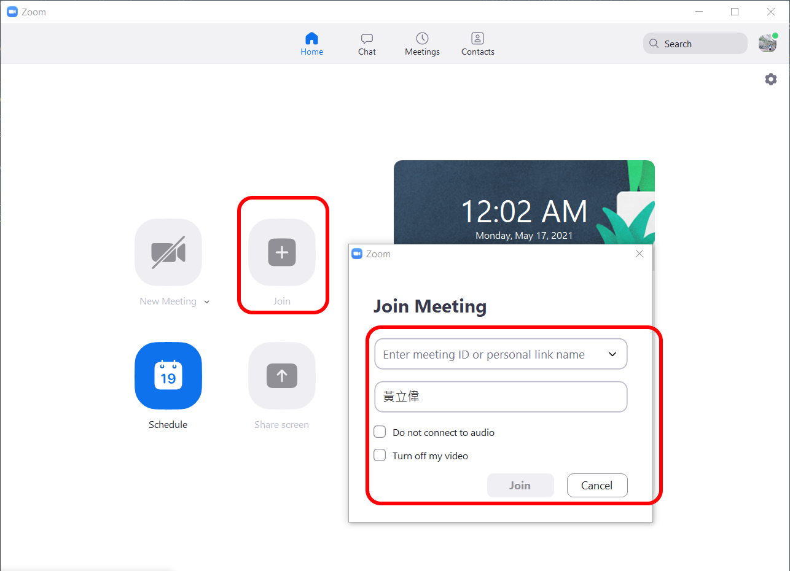
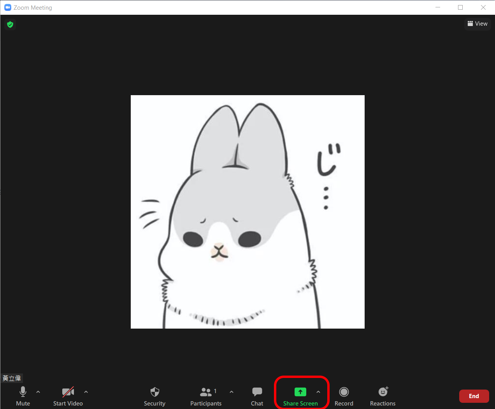
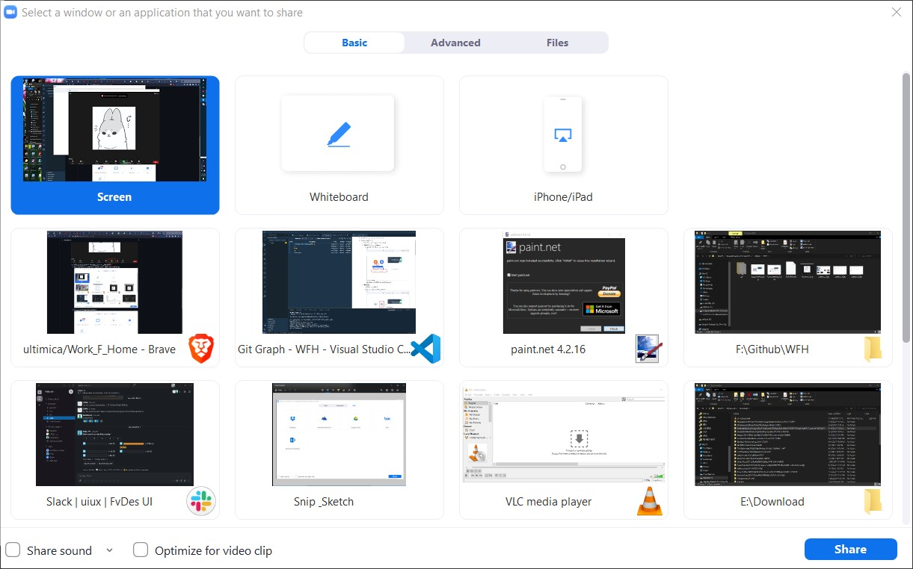
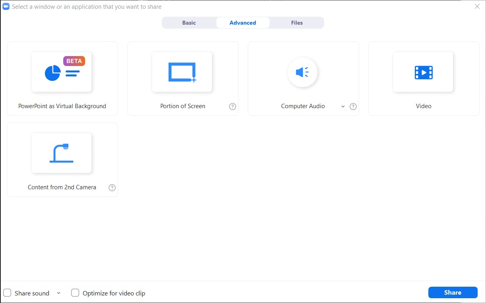
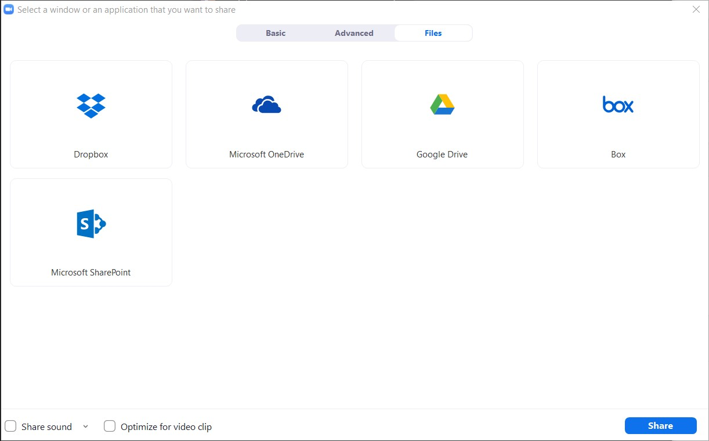

# Work From Home Tips

## 1. 視訊會議工具

**Zoom**

- Download link :   [ offical download site](https://zoomnow.net/zntw_zoom_download.php?showType=ALL)
- Simple Usage (PC):
  - Register with google or some email 
  - **會議主持人** Host a Meeting :
    - 使用個人PIN 碼 (ex: 686 273 9019)
     
    直接點擊大按鈕即可產生會議,等待連接
  - **連接會議**:
    - 點擊join 參加會議
    - 輸入 PIN 碼 (ex: 686 273 9019)
    - 
  - **螢幕分享** Share Screen
    - 主持人可以分享螢幕(*其他人也可以,主持人可以設定開關*) 大家可以一起觀看
    - 點擊Share Screen 共享資訊
      
      *P.S. 點擊左上角的小盾牌 可以知道現在這個meeting的相關資訊*
      - **Basic** 現存的Windows視窗 (可以全螢幕,或是單一視窗,或是可以協作白板)
        
      - **Advance** 影片 或是任意桌面的部分
        
      - **Files** Cloud的檔案
        

## 2. 協作工具

方便可以產生不同的channel 然後可以在裏頭分別討論Project或是語音討論

我覺得這個app用起來還算方便 可以考慮之後協作討論

**Slack**

- Download link :   [ offical download site](https://slack.com/intl/en-tw/downloads/windows)
- Register with google or company's email
- 可以有網頁版, windows 也有專門的app, IOS/Android也都有
- 以下做一些名詞解釋
  - **Workspace** 最大的分類別 (Ex. FatekCorp.)
  - **Channel** 每個Workspace 可以有很多channel 用來分群討論 (ex. PLC, HMI, 或是專案...etc)
- 所以可以把所有員工 加到同一個Workspace,然後可以建立各種不同的channel 來分類討論事情